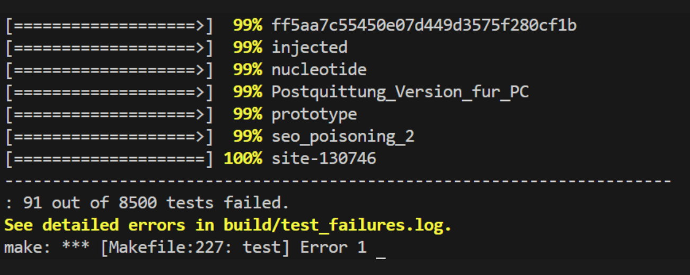

# JavaScript Compiler (C Implementation)

如果您想自己手动构建项目     解压bin.rar   后放入项目根目录下   然后按照教程操作即可

项目结构如下示例

```
js_compiler_by_c
	\bin
	\其他
```

## 概述

`js_compiler_by_c` 是一个用 C 语言实现的 JavaScript 前端，覆盖 ES5.1 以及多数 ES2015/ES2017 语法。它包含 re2c 词法分析器、支持 GLR 的 GNU Bison 语法分析器、符合 ECMAScript 规范的自动分号插入 (ASI) 适配层，以及可遍历的 AST，用于批量校验数据集脚本。

## 构建与测试速览

### Windows（PowerShell，使用 `make.cmd`）

```powershell
# 构建（自动运行 re2c、Bison、GCC）
.\make

# 显式重新生成语法分析器与 AST 入口
.\make parser

# 运行测试（可传文件或目录）
.\make test                     # 整个 test/ 目录
.\make test test\es6_stage4     # 相对路径
.\make test D:\path\to\files  # 绝对路径

# 清理由构建产生的文件
.\make clean
```

- 仓库自带的 `make.cmd` 会把 `bin/` 内的 gcc、re2c、bison、m4 加入 `PATH`，并设置 `BISON_PKGDATADIR`，无需另装 MSYS2 即可在 PowerShell/CMD 下构建。
- 修改 `src/lexer.re` 或 `src/parser.y` 后请执行 `.\make parser`（必要时加 `-B`），以保持根目录镜像文件与 `build/generated/` 一致。

### 常用目标

| 目标            | 说明                                 |
| --------------- | ------------------------------------ |
| `.\make`        | 构建词法分析器 `js_lexer.exe`        |
| `.\make parser` | 重新运行 re2c/Bison 并生成解析器产物 |
| `.\make test`   | 解析指定路径下的全部文件             |
| `.\make clean`  | 清理 `build/` 目录                   |

- `build/parser_error_locations.log` 会在 `make test` 前清空，失败项以 `路径:行:列:错误` 形式记录，VS Code 中可直接跳转。
- `build/test_failures.log` 保存完整输出；设置 `JS_PARSER_TRACE=1` 可附带 GLR 轨迹。

## 项目组成

1. **词法层**：`re2c` 负责切分 Token，支持 Unicode 标识符、模板片段、BigInt、正则字面量与上下文 Token（如 `FUNCTION_DECL`、`ARROW_HEAD`）。
2. **语法层**：GNU Bison 的 GLR 模式覆盖 Script/Module 语法，含 `import/export`、类、生成器、解构、模板、`for-of`、标签语句、`try/catch/finally` 等。
3. **ASI 适配层**：`parser_lex_adapter.c` 把 lexer Token 投递给 Bison，并在行终止、EOF 或受限产生式处插入虚拟分号，额外处理 `catch`、IIFE、三元表达式对象字面量等场景。
4. **AST 框架**：`ast.c/.h` 定义 90+ 种节点，`--dump-ast` 可输出可读结构，`ast_traverse` 与 `ast_free` 便于遍历与释放。

### 目录速查

- `src/`：权威源文件（lexer/parser/AST/适配层）。
- `build/`：生成的源码、二进制、`parser_error_locations.log`、`test_failures.log`、调试轨迹。
- `bin/`：随仓库提供的便携式 mingw64 工具链。
- `test/`：基础用例、ES6 分阶段用例、数据集脚本。
- `tmp/`：最小复现脚本与 `trace_compare.py` 等工具。

## 核心子系统

### 词法分析

- 输入 UTF-8，记录 `has_newline`、花括号深度、模板状态与上一个 Token，便于 ASI 与正则判定。
- 识别 ES5/ES6 关键字、私有标识符、`...`、`=>`、模板片段、BigInt、二/八/十六进制数字、正则字面量等。

### 语法分析

- 使用 GLR 与 `%expect` 控制冲突，涵盖 `import/export`、class、async/generator、`for-of`、解构、模板、spread/rest、标签、`try/catch/finally`、`with` 等语法。
- `_no_obj`、`_no_in`、`_no_arr` 变体避免语句块与对象字面量冲突，同时控制 `for-in`/`for-of` 的 lookahead。

### 自动分号插入（ASI）

- 严格遵循 ECMA-262 §11.9（换行、EOF、受限产生式），并针对 `catch`、`new`+IIFE、多行三元表达式、模板、`=>`、`await/yield`、`? :` 等场景增加保护。
- 使用 `g_pending` 缓存真实 Token，`g_conditional_depth` 标记三元表达式中的对象字面量。

### AST

- 覆盖 Program/Module、Import/Export、Class/Method、Binding Pattern、Spread/Rest、`for-of`、`yield`、模板、箭头函数等节点。
- `js_parser.exe --dump-ast file.js` 可直接打印 AST；`ast_traverse` 支持自定义遍历；`ast_free` 确保大规模解析无内存泄漏。

### 调试与日志

- `build/parser_error_locations.log`：失败列表。
- `build/test_failures.log`：完整日志，可与 Node/V8 对比。
- `tmp/trace_compare.py`：比较 GLR 轨迹峰值与分裂情况。
- `JS_PARSER_TRACE=1 js_parser.exe file.js`：启用 Bison `%debug`，便于定位语法问题。

## 测试覆盖

| 测试目录/文件             | 覆盖内容                               |
| ------------------------- | -------------------------------------- |
| `test/test_basic.js`      | 综合语法                               |
| `test/test_simple.js`     | 轻量级冒烟测试                         |
| `test/test_functions.js`  | 函数声明/表达式                        |
| `test/test_for_*`         | 传统 for、for-in、标签控制             |
| `test/test_literals.js`   | 各类字面量                             |
| `test/test_asi_*`         | ASI 基础、return、控制流               |
| `test/test_try.js`        | try/catch/finally、with                |
| `test/test_switch.js`     | switch/case/default                    |
| `test/test_error_*.js`    | 常见语法错误（缺冒号/括号/分号等）     |
| `test/es6_stage1`         | 解构与默认/rest 参数                   |
| `test/es6_stage2`         | 箭头函数与参数系统                     |
| `test/es6_stage3`         | 模板字符串与 tagged template           |
| `test/es6_stage4`         | 类与增强对象字面量                     |
| `test/es6_stage5`         | `for-of`、生成器、spread/rest、`yield`  |

建议在语法或 ASI 变更后执行 `make clean && make parser && make test test/JavaScript_Datasets/goodjs`，并针对单个复现脚本运行 `make test tmp/repro_xxx.js`。

### 测试badjs

测试badjs，测试结果如下



### 测试goodjs


## 内存耗尽问题

- 通过 `%debug` + `JS_PARSER_TRACE=1` + `tmp/trace_compare.py` 观察 GLR 分裂热点（如 `tmp/repro_mem10.js` 与 `tmp/repro_mem16.js`）。
- 在 `parser.y` 中将 `YYMAXDEPTH` 提升到 1,000,000，避免在 GLR 项数较大时提前崩溃。
- 规划通过共享前缀/后缀或拆分赋值左值非终结符来降低 `_no_obj/_no_arr/_no_in` 的组合爆炸，目标是将 `.` 引发的分裂降低 30%以上。
- 每次语法调整都需要重新跑复现脚本、ES6 分阶段用例与 `goodjs`，并记录新的轨迹统计。

## ES2015+ 支持现状

| 状态 | 说明 |
| ---- | ---- |
| 已完成 | 解构绑定（声明/参数/catch/for-in-of）、默认/rest 参数、箭头函数（LineTerminator 校验）、模板字符串与 tagged template、类（继承、静态/访问器/计算属性）、增强对象字面量、生成器 (`function*`/`yield*`)、`for-of`、数组/调用中的 spread/rest、`yield` ASI 规则、解构赋值、`new` 调用链修复、三元表达式对象字面量护栏、表达式语句中的 `in`。 |
| 计划中 | 对象字面量 spread (`{ ...obj }`)、模块语法与模式切换（`import`/`export` 系列）、`async/await` 与 async generator／`for-await-of`、`new.target`、`super.prop = expr` 等语义限制、可选链/空值合并/ES2020+ 语法、更丰富的多错误诊断。 |

每次更新相关语法后，请运行 `make test test/es6_stageX`（X = 1~5），并把未支持语法及其文件路径记录到路线图中。

## 调试提示

- `js_lexer.exe path\file.js` 查看 Token 流。
- `js_parser.exe --dump-ast file.js` 输出 AST。
- 在 `parser_lex_adapter.c` 中加入日志方便分析 ASI 结果。
- `JS_PARSER_TRACE=1 js_parser.exe tmp/repro_mem10.js > tmp/trace_mem10.log` 后结合 `python tmp/trace_compare.py ...` 比较 GLR 轨迹。
- `node --check file.js` 可先确认源码自身是否合法。

## 参考资料

- [ECMAScript 5.1 规范](https://262.ecma-international.org/5.1/)
- [re2c 手册](https://re2c.org/manual/manual_c.html)
- [GNU Bison 手册](https://www.gnu.org/software/bison/manual/)
- [Esprima](https://esprima.org/) / [Acorn](https://github.com/acornjs/acorn)

---

许可证：MIT License；维护者：Stardreama 及社区贡献者；最后更新时间：2025-12-05

